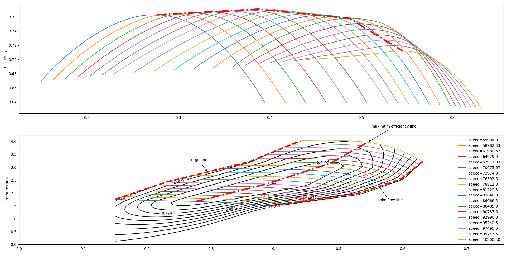

# pysmartengine-A simple python package for internal combustion engine simulation


 [TOC]

## Compressor

### Simple compressor

### Compressor based on map

pysmartengine is easy to generate compressor map using compressor map data, the sample compressor map data can be seen in [Compressor Map](./tests/CompressorMap.xlsx). you can plot the map in three steps:

1. read the map file
2. interpolate map
3. plot the map 

```python
Map = Compressor("./CompressorMap.xlsx")
Map.interpolate(5) #generate 5 lines between each constant speed line
Map.plot()
```

then you can get the map plot seen bellow:


